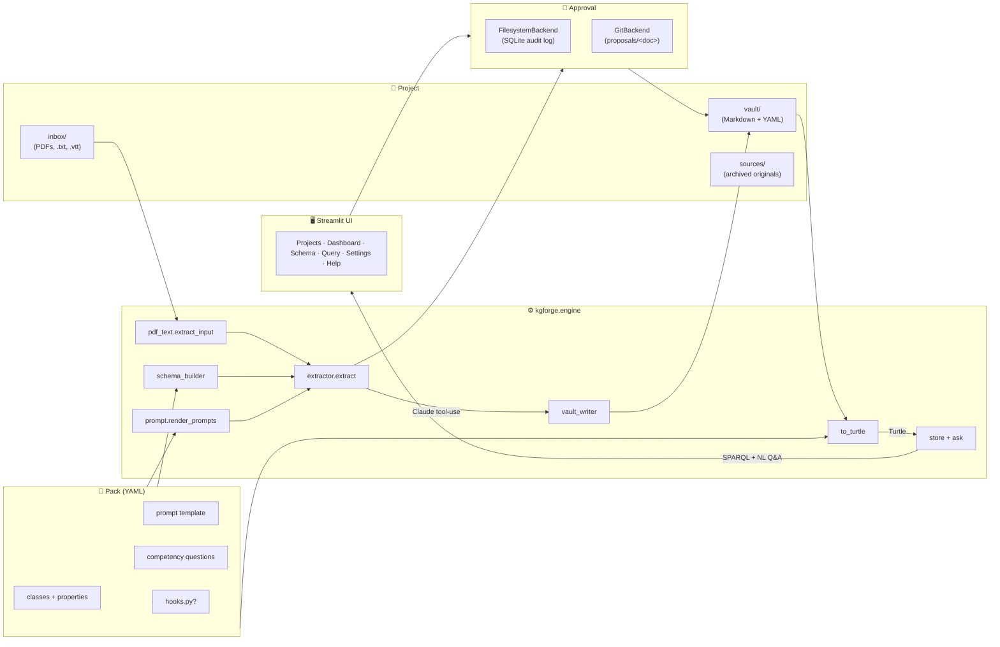

# kgforge

**Turn structured documents into a queryable, citable knowledge graph — with a human in the loop on every entity.**

`kgforge` is a configurable pipeline:

```
documents (PDF · txt · vtt)
        ↓
  Claude tool-use extraction          ← classes + properties + prompt from a YAML pack
        ↓
  vault/ (Markdown + YAML, one file per entity)
        ↓
  human approval (filesystem or git)  ← reviewable, diffable
        ↓
  Turtle RDF → in-memory Oxigraph
        ↓
  competency queries · natural-language Q&A
```

The original demo (Caribbean compliance ontology — Jamaica DPA 2020 with FIBO alignment) still ships as one of two built-in **packs**. A second pack covers **qualitative thematic analysis** of interview transcripts. New domains are a YAML file away.

---

## Why kgforge

- **Declarative domain config.** Classes, properties, prompts, IRIs, hooks and competency questions all live in one validated `pack.yaml`. Swap a pack → drive the same pipeline against a different vocabulary.
- **Two approval workflows.** `filesystem` backend (SQLite audit log + in-app approve/reject) for solo work; `git` backend (proposal branches + PR-style merge) for the original Caribbean Compliance demo. Pick per project.
- **UI or CLI.** A Streamlit app handles upload → review → query without the terminal. Every page also has a script shim under `scripts/` for power users and automation.
- **Grounded answers.** Natural-language questions are answered by synthesising SPARQL against the pack schema, executing in pyoxigraph, and citing the vault files that produced each row.
- **Source of truth is files.** Vault entries are Markdown with YAML frontmatter — readable, editable, `git diff`-able. The Turtle graph is regenerated from them on every query.

---

## Install

```bash
git clone https://github.com/elroy-galbraith/carib-comp-ont.git
cd carib-comp-ont
pip install -e ".[curator,ui]"          # engine + git backend + Streamlit UI
# or, for the heavy layout-aware PDF extractor:
pip install -e ".[curator,ui,docling]"  # adds docling (pulls PyTorch)
```

Set your Anthropic key once:

```bash
echo "ANTHROPIC_API_KEY=sk-ant-…" > .env
```

`pyproject.toml` exposes these extras: `curator` (watchdog + gitpython), `ui` (Streamlit), `docling` (heavy, layout-aware PDF), `all` (everything), `dev` (pytest + ruff).

---

## Quickstart — UI

```bash
streamlit run kgforge/ui/app.py
```

1. **Projects** — open the bundled `compliance` project (Caribbean DPA, git backend) or `thematic` (interview transcripts, filesystem backend). Or create a new project from a template.
2. **Dashboard** — drag a PDF (or `.txt` / `.vtt` for transcripts) into the inbox, click **Process all**. Each document becomes a pending submission; expand it to see proposed entities; Approve or Reject.
3. **Query** — pick a pre-canned competency question or type a natural-language one. The generated SPARQL is collapsible if you want to see it.
4. **Schema** — read-only inspector of the active pack's classes, properties, prompt, and generated tool-use JSON Schema.
5. **Settings** — local override for the Anthropic key + cache reload.
6. **Help** — in-app tour of the workflow and concepts.

---

## Quickstart — CLI

The Streamlit UI is a wrapper around the same engine the scripts use. The scripts in `scripts/` are ~50-line shims around `kgforge.engine` functions:

```bash
# Run the bundled compliance project end-to-end without the UI
python scripts/curator.py --once --pack compliance --backend git
# → extracts every PDF in inbox/, commits each to proposals/<doc-id>, ready for git merge

# Rebuild the Turtle graph from the vault
python scripts/to_turtle.py --pack compliance

# Run the three competency queries
python scripts/load_to_oxigraph.py --pack compliance

# Ask a natural-language question with citations
python scripts/ask.py "Which obligations apply to a data controller?" --show-sparql
```

Switch packs by changing `--pack compliance` → `--pack thematic`. Switch backends with `--backend filesystem`.

---

## What ships

```
carib-comp-ont/
├── kgforge/                         # the platform
│   ├── pack/                        # pack model + loader
│   │   ├── model.py                 # Pydantic DomainPack
│   │   ├── loader.py                # load_pack / load_builtin + hook discovery
│   │   └── builtin/
│   │       ├── compliance/          # Statute · Provision · Definition · Regulator · Obligation
│   │       │   ├── pack.yaml
│   │       │   └── hooks.py         # legal-definition term-name regex for highlighter
│   │       └── thematic/            # Theme · Subtheme · Code · Excerpt
│   │           ├── pack.yaml
│   │           ├── schema.ttl       # RDFS ontology
│   │           ├── sparql/cq*.rq
│   │           └── hooks.py         # speaker-line stripper + interview_NN doc_id collapse
│   ├── engine/                      # pack-driven, domain-neutral
│   │   ├── pdf_text.py              # PDF (docling/pdfplumber) + text/markdown/vtt ingestion
│   │   ├── schema_builder.py        # build_entity_schema(pack) for Anthropic tool-use
│   │   ├── prompt.py                # render system+user from pack.prompt
│   │   ├── vault_writer.py          # entity → Markdown+YAML (handles multi-value props)
│   │   ├── extractor.py             # PDF/text → LLM → vault
│   │   ├── to_turtle.py             # vault Markdown → Turtle (datatype + multi-value)
│   │   ├── store.py                 # pyoxigraph load + run_query
│   │   ├── ask.py                   # NL → SPARQL → answer (2 LLM calls)
│   │   ├── highlight.py             # per-entity PDF highlights via pymupdf; pack hook for needles
│   │   └── curator.py               # watchdog inbox + ApprovalBackend dispatch
│   ├── approval/                    # how a batch gets reviewed
│   │   ├── base.py                  # ApprovalBackend ABC + Submission + SubmissionRef
│   │   ├── filesystem.py            # SQLite audit log; reject moves files to .rejected/
│   │   └── git.py                   # proposal branches + commit; approve merges to main
│   ├── project/project.py           # Project = pack + paths + approval backend
│   └── ui/                          # Streamlit
│       ├── app.py
│       └── pages/                   # 1_Projects · 2_Dashboard · 3_Schema · 4_Query · 5_Settings · 6_Help
├── projects/                        # one folder per project
│   ├── compliance/project.json      # points at repo-root vault/, inbox/, schema/, sparql/; git backend
│   └── thematic/                    # synthetic interview vault for demoing the second pack
│       ├── project.json
│       └── vault/*.md               # hand-curated for end-to-end verification without an LLM
├── scripts/                         # thin CLI shims (~50 lines each) over kgforge.engine
├── schema/carib_compliance.ttl      # original DPA schema (referenced by the compliance project)
├── vault/                           # original DPA vault (the compliance project's vault_dir)
├── sparql/                          # original DPA competency queries
├── inbox/                           # default drop-zone for the compliance project
├── pyproject.toml                   # package metadata + optional extras
└── README.md
```

---

## Authoring a new pack

A pack is a folder with one required file (`pack.yaml`) and three optional ones (`schema.ttl`, `sparql/*.rq`, `hooks.py`). The minimal shape:

```yaml
# kgforge/pack/builtin/<your-pack>/pack.yaml
schema_version: 1

metadata:
  name: your_domain      # snake_case identifier
  label: "Your domain"

namespaces:
  base_iri:      "https://your.org/your-domain/"
  entity_iri:    "https://your.org/your-domain/entity/"
  prefix:        "yd"
  entity_prefix: "yde"

classes:
  - {name: Thing, label: "Thing"}
  # … add as many classes as you need (min 1). Use `parent:` for rdfs:subClassOf.

properties:
  - {name: relatesTo, domain: Thing, range: Thing}
  - {name: tag,       domain: Thing, range: "xsd:string", datatype: true}

prompt:
  version: v1
  system: |
    You extract entities from <documents of your domain>.
    Use only these classes: Thing.
    Always prefix entity IDs with the document ID ({doc_id}_).
  user: |2
        {few_shot}
        Document ID: {doc_id}

        ---
        {text_window}
        ---
  few_shot: |
    (a worked input → output example, ideally one of each class)

competency_questions:
  - {id: cq1, label: "All entities", file: sparql/cq1_all.rq}

models:
  extractor: claude-haiku-4-5-20251001
  ask:       claude-sonnet-4-6

inbox:
  accepted_extensions: [".pdf", ".txt"]
```

Then create a project that points at it:

```json
// projects/<your-project>/project.json
{
  "name": "your_project",
  "label": "Your project",
  "pack": "builtin/your_domain",
  "vault_dir": "vault",
  "inbox_dir": "inbox",
  "sources_dir": "vault/sources",
  "schema_ttl": "../../kgforge/pack/builtin/your_domain/schema.ttl",
  "sparql_dir": "../../kgforge/pack/builtin/your_domain/sparql",
  "approval": {"backend": "filesystem"}
}
```

Or just open the **Projects** page in the UI and create it from a template — it scaffolds the project folder + a copy of the chosen pack so you can edit without touching the bundled defaults.

### Optional `hooks.py`

Pack-specific Python overrides for parts of the engine. The loader looks up four function names; supply any subset:

| Function | What it overrides |
|---|---|
| `derive_doc_id(stem) -> str` | Custom filename → document-ID rule (e.g. `interview_03` → `interview03`) |
| `search_variants(source_text) -> list[str]` | Highlight needle generation (compliance ships a legal-definition regex; thematic strips speaker prefixes) |
| `post_extract(entities) -> entities` | Last-mile transforms on the LLM output before vault write |
| `validate_entity(entity) -> list[str]` | Per-entity validation; non-empty list = reject |

---

## Approval backends

The engine never talks to git directly. Each project picks a backend in its `project.json`:

| Backend | When to use | What it does |
|---|---|---|
| `filesystem` *(default)* | Solo work, journalling, lit review, the UI's in-app review flow | Vault writes happen directly; SQLite audit log records each submission; reject moves files to `vault/.rejected/<doc_id>_<ts>/` |
| `git` | Multi-reviewer settings; the original carib-comp-ont demo; whenever you want diffable PR-style history | Each submission is a `proposals/<doc_id>` branch with a structured commit; approve merges to `main`, reject deletes the branch |

The git backend honours an explicit `repo_root` in approval config and otherwise walks up from the vault until it finds a `.git/`.

---

## Bundled packs

### `compliance` — Caribbean Compliance Ontology

Five classes (`Statute`, `Provision`, `Definition`, `Regulator`, `Obligation`) with FIBO alignment for Statute and Regulator. Three competency questions (obligations on data controllers; regulators; defined terms). Hand-curated seed of eight entities from Jamaica DPA 2020 §1–§10. Used by the bundled `compliance` project with the **git** backend — preserves the original PR-as-mutation methodology.

### `thematic` — Qualitative Thematic Analysis

Four classes (`Theme`, `Subtheme`, `Code`, `Excerpt`) for interview transcripts. Three competency questions (recurring codes; excerpts per theme; everything spoken by a participant). First built-in pack with a **datatype property** (`spokenBy: xsd:string`) and **multi-valued** object properties (`codedAs` can take a list of Codes per Excerpt). Used by the bundled `thematic` project with the **filesystem** backend.

---

## Architecture



---

## Verifying changes

Each phase of the refactor was kept behaviour-preserving for the original compliance pipeline. The deterministic surfaces (Turtle output, SPARQL CQ row sets, the generated JSON Schema, rendered prompts, vault frontmatter, highlight annotation marker) all have byte-identical baselines in `baselines_pre/`. To verify your changes haven't drifted the compliance pipeline:

```bash
python scripts/to_turtle.py --print > baselines/vault.ttl
python scripts/load_to_oxigraph.py > baselines/cq_output.txt
diff -ru baselines_pre/ baselines/
# expect: silent (no diff)
```

The thematic pack is verified by a hand-curated 11-entity vault that exercises every CQ without requiring an LLM call:

```bash
python -c "
from kgforge.project import load_project
from kgforge.engine import to_turtle, store, ask
p = load_project('thematic')
p.vault_ttl.write_text(to_turtle.build_turtle(p.vault_dir, p.pack), encoding='utf-8')
s = store.load_store(p.schema_ttl, p.vault_ttl)
for cq in p.pack.competency_questions:
    sparql = (p.pack.pack_dir / cq.file).read_text(encoding='utf-8')
    print(cq.id, len(ask.run_sparql(s, sparql)['rows']))
"
# expect: cq1 3 / cq2 6 / cq3 4
```

---

## Acknowledgements

This work is informed by and complementary to:

> Donalds, C., Barclay, C., & Osei-Bryson, K.-M. (2023).
> *Towards a Cybercrime Classification Ontology for Developing Countries.*

The original carib-comp-ont prototype (now the `compliance` pack) was built as an outreach artifact for that team. The `kgforge` generalisation grew from the observation that the same pipeline — PDF → typed entities → graph → review → SPARQL — fits many other PDF-heavy research workflows (literature reviews, qualitative coding, policy analysis).

---

## See also

- [`HELD_OUT.md`](HELD_OUT.md) — evaluation corpus quarantine policy
- [`docs/demo_script.md`](docs/demo_script.md) — original 2-minute compliance demo walk-through
- [`docs/outreach/one_pager.md`](docs/outreach/one_pager.md) — one-page summary for outreach

---

## License

MIT © 2026 Elroy Galbraith
