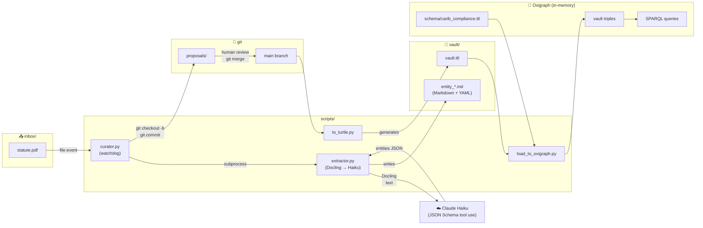

# Caribbean Compliance Ontology — Prototype

A minimal end-to-end demonstration of the **curator-agent methodology** for
converting Caribbean statutory text into structured, queryable RDF.

**Primary statute:** Jamaica Data Protection Act 2020 (DPA 2020)  
**Differentiating idea:** PR-as-ontology-mutation — every proposed ontology
change arrives as a reviewable git branch that a human can inspect, debate,
and merge (or reject).

> This work is complementary to Donalds, Barclay & Osei-Bryson (2023)
> *Towards a Cybercrime Classification Ontology for Developing Countries*.
> That work covers cybercrime classification; this prototype covers
> privacy-compliance obligations. Alignment between the two artifacts is a
> planned Phase 2 activity.

---

## Quickstart (≤ 5 minutes)

```bash
# 1. Clone and install
git clone https://github.com/elroy-galbraith/carib-comp-ont.git
cd carib-comp-ont
pip install -r requirements.txt

# 2. Generate Turtle from the hand-curated seed
python scripts/to_turtle.py
# → writes vault/vault.ttl

# 3. Load into Oxigraph and run the three competency queries
python scripts/load_to_oxigraph.py
# → answers CQ1 (obligations), CQ2 (regulators), CQ3 (definitions)

# 4. Drop a DPA PDF into inbox/ and watch the curator loop
python scripts/curator.py --once
# → runs extractor, opens proposals/<doc-id> branch, commits new vault files

# 5. Review the proposed PR
git log proposals/<doc-id>
git diff main...proposals/<doc-id>
git checkout main && git merge proposals/<doc-id>
```

---

## Architecture



---

## Repository layout

```
carib-comp-ont/
├── schema/
│   └── carib_compliance.ttl   # OWL schema: 5 classes, 5 properties, FIBO subclass
├── vault/
│   ├── dpa2020.md             # Statute — Data Protection Act 2020
│   ├── dpa2020_s2.md          # Provision — §2 Interpretation
│   ├── dpa2020_s2_*.md        # Definitions from §2 (×4)
│   ├── dpa2020_ico.md         # Regulator — Information Commissioner
│   ├── dpa2020_obligation_*.md# Obligations
│   └── vault.ttl              # Generated — do not edit manually
├── scripts/
│   ├── extractor.py           # PDF → Docling → Haiku → Markdown+YAML
│   ├── curator.py             # inbox watcher → extractor → git PR
│   ├── to_turtle.py           # vault/*.md → Turtle triples
│   └── load_to_oxigraph.py    # Turtle → Oxigraph → SPARQL
├── sparql/
│   ├── cq1_obligations_on_controller.rq
│   ├── cq2_regulators.rq
│   └── cq3_definitions.rq
├── inbox/                     # Drop PDFs here for the curator to process
│   └── processed/             # PDFs move here after extraction
├── docs/
│   ├── demo_script.md
│   └── outreach/
│       ├── one_pager.md
│       └── email_draft.md
├── requirements.txt
└── README.md
```

---

## Schema overview

| Class | FIBO alignment | Description |
|---|---|---|
| `cco:Statute` | `fibo-fbc-fct-rga:Regulation` | Enacted primary legislation |
| `cco:Provision` | — | Numbered section or subsection |
| `cco:Definition` | subclass of Provision | Term formally defined within a provision |
| `cco:Regulator` | `fibo-be-ge-ge:GovernmentalAuthority` | Enforcement body |
| `cco:Obligation` | — | Duty imposed on a specified party |

| Property | Domain | Range | Description |
|---|---|---|---|
| `cco:definedIn` | Definition | Provision | Where a term is defined |
| `cco:enforcedBy` | Statute | Regulator | Enforcement relationship |
| `cco:imposesObligationOn` | Obligation | (entity) | Obligation bearer |
| `cco:applicableTo` | Provision | (entity) | Governing scope |
| `cco:relatedTo` | Thing | Thing | General association |

---

## Hand-curated seed (DPA 2020 §1–§10)

Eight entities manually extracted to validate the data shape before automation:

| Entity | Class | Source |
|---|---|---|
| Data Protection Act 2020 | Statute | §1 |
| DPA 2020 §2 — Interpretation | Provision | §2 |
| Personal Data | Definition | §2 |
| Data Subject | Definition | §2 |
| Data Controller | Definition | §2 |
| Data Processor | Definition | §2 |
| Information Commissioner | Regulator | §5 |
| Obligation to Process Lawfully | Obligation | §10 |

---

## Competency questions

| # | Question | Query file |
|---|---|---|
| CQ1 | List every obligation imposed on a DataController by the DPA | `sparql/cq1_obligations_on_controller.rq` |
| CQ2 | Which regulators enforce the DPA 2020? | `sparql/cq2_regulators.rq` |
| CQ3 | What terms are formally defined in the DPA 2020? | `sparql/cq3_definitions.rq` |

---

## Demo script

See [docs/demo_script.md](docs/demo_script.md) for the two-minute walk-through.

---

## Scope

**In scope (prototype):** DPA 2020 §1–§10, FIBO alignment for Regulator and
Statute, single-shot Haiku extractor, minimal git-PR curator loop, Oxigraph
SPARQL, CLI-only.

**Deliberately deferred:** Cybercrimes Act 2015, BOJ circulars, SHACL shapes,
OWL 2 RL reasoning, Sonnet escalation, gold-standard annotation, web UI.

---

## Acknowledgements

This prototype is informed by and complementary to:

> Donalds, C., Barclay, C., & Osei-Bryson, K.-M. (2023).
> *Towards a Cybercrime Classification Ontology for Developing Countries.*

The cybercrime and privacy-compliance domains intersect at incident-response
obligations and data-breach definitions. Alignment between these ontologies
is a planned Phase 2 activity; we welcome feedback from the original authors.

---

## License

MIT © 2026 Elroy Galbraith
